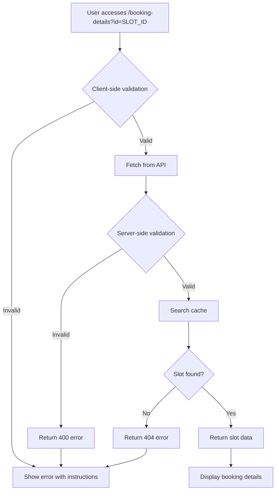

# 🔒 Booking Slot ID Validation

This document explains how the booking system validates slot IDs and handles invalid booking URLs.

## 🛡️ Validation Layers

### 1. Client-Side Validation (BookingDetails Component)

**Basic Format Checks:**
- ✅ Slot ID must be present
- ✅ Slot ID must be a string
- ✅ Slot ID must be at least 10 characters long
- ✅ Slot ID must contain a hyphen (-)

**Error Messages:**
- `"No booking slot specified. Please select a time slot from the booking page."`
- `"Invalid booking slot format. Please select a valid time slot."`
- `"Invalid booking slot ID format. Please select a time slot from the booking page."`

### 2. Server-Side Validation (API Endpoint)

**Enhanced Format Checks:**
- ✅ Slot ID presence validation
- ✅ Type validation (must be string)
- ✅ Length validation (minimum 10 characters)
- ✅ Structure validation (must contain hyphen)
- ✅ Character validation (alphanumeric, hyphens, underscores only)

**Regex Pattern:** `/^[a-zA-Z0-9\-_]+$/`

**Error Responses:**
```json
{
  "success": false,
  "error": "Slot ID is required"
}
```

```json
{
  "success": false,
  "error": "Invalid slot ID format. Please use a valid booking link."
}
```

```json
{
  "success": false,
  "error": "Slot ID contains invalid characters"
}
```

### 3. Data Existence Validation

**Cache Lookup:**
- ✅ Searches through all non-expired cache entries
- ✅ Validates slot exists in booking data
- ✅ Ensures slot data is complete and valid

**Error Responses:**
```json
{
  "success": false,
  "error": "No booking data available. Please try selecting a new time slot from the booking page."
}
```

```json
{
  "success": false,
  "error": "This booking slot is no longer available or has expired. Please select a new time slot."
}
```

## 🎨 User Experience

### Error Display Features

**Visual Elements:**
- ⚠️ Warning icon for all error states
- 🎯 Context-specific error titles
- 📝 Clear, actionable error messages
- 🔄 Multiple action buttons (Go Back, Select New Slot)

**Error Categories:**

1. **Invalid Booking Link**
   - Triggered by: Malformed slot IDs, invalid characters
   - Shows: Instructions on how to book properly

2. **Slot No Longer Available**  
   - Triggered by: Expired or non-existent slots
   - Shows: Guidance to select a new time slot

3. **Network/System Errors**
   - Triggered by: API failures, network issues
   - Shows: Generic retry instructions

### Help Section

For invalid booking links, users see:

```
💡 How to book properly:
1. Go to the booking section
2. Select your preferred beach  
3. Choose a date
4. Click "Book" on an available time slot
```

## 🔧 Developer Features

### Console Warnings

Invalid slot ID attempts are logged:
```javascript
console.warn(`Invalid slot ID format attempted: ${slotId.substring(0, 20)}...`);
console.warn(`Slot ID with invalid characters attempted: ${slotId.substring(0, 20)}...`);
```

### Error Handling Flow



## 🧪 Testing Invalid IDs

Common invalid slot ID patterns:

| Pattern | Example | Error |
|---------|---------|-------|
| Empty | `""` | "No booking slot specified" |
| Too short | `"abc"` | "Invalid booking slot ID format" |
| No hyphen | `"invalidformat"` | "Invalid booking slot ID format" |
| Special chars | `"test@#$%"` | "Slot ID contains invalid characters" |
| Valid format, not found | `"20250101T000000000-validformat"` | "Slot no longer available" |

## 📅 Past Date Prevention

The booking calendar prevents users from selecting dates that have already passed:

### Visual Indicators
- **Past dates**: Grayed out with 50% opacity and "cursor-not-allowed"
- **Hover tooltips**: "Cannot book lessons for past dates"
- **Today's date**: Highlighted with special border color
- **Future dates**: Normal appearance with hover effects

### Navigation Controls
- **Previous month button**: Disabled when viewing current month
- **Tooltip feedback**: "Cannot view past months" when disabled
- **Month validation**: Automatically prevents navigation to past months

### Date Selection Logic
```javascript
const isPastDate = date < new Date(today.getFullYear(), today.getMonth(), today.getDate());
```

### Automatic Cleanup
- Selected dates are cleared if they become invalid
- Occurs when navigating months or on component update
- Prevents stale past date selections

### Server-Side Validation
```javascript
const todayStart = new Date(today.getFullYear(), today.getMonth(), today.getDate());
if (date < todayStart) {
  setError('Cannot select dates in the past. Please choose today or a future date.');
  return;
}
```

## 🔐 Security Benefits

- **Prevents URL manipulation**: Users cannot modify booking data
- **Input sanitization**: All slot IDs are validated and sanitized
- **Rate limiting friendly**: Invalid requests fail fast
- **Audit trail**: Invalid attempts are logged for monitoring
- **User guidance**: Clear instructions prevent user frustration
- **Past date prevention**: Users cannot book lessons for dates that have passed
- **Date validation**: Both client and server-side checks prevent invalid bookings 